Iker Patiño Alvarez Implantació d'Aplicacions Web

**Ejercicio 1: Introducción a git y**

**GitHub**

1. **Crea un compte a GitHub (Si no el tens!!!). La forma d’accedir als repositoris remots de GitHub serà per SSH, per tant has de copiar la teua clau pública RSA a GitHub, per això:**
- **Copia el contingut del teu fitxer ~/.ssh/id\_rsa.pub, per això: afegeix una nova clau SSH a l’apartat “SSH keys” del teu perfil a GitHub i enganxa el contingut de la teua clau pública.**
- **Si no teniu aquest fitxer, podeu generar una nova clau ssh pública seguint les instruccions de l’article Treballant amb claus ssh.**
- **Un cop finalitzat aquest exercici, hauràs de repetir-ho fent ús de tokens.**
2. **Crea a GitHub un repositori amb el nom prova\_el\_teu\_nom (inicialitza el repositori amb un fitxer README) i la descripció Repositorio de prueba 2ASIX.**

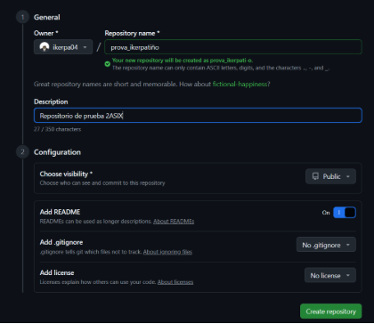

3. **Instal·la git en el teu ordinador (si no el tens instalado!!!). apt-get install git**

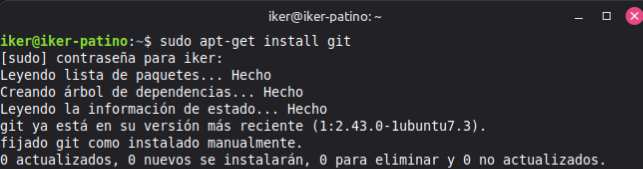

4. **Configuració de git. El primer que hauries de fer quan instal·les Git és establir el teu nom dusuari i adreça de correu electrònic (Assegura’t que les dades són correctes i que has posat el teu nom complet). Això és important perquè les confirmacions de canvis (commits) a Git utilitzen aquesta informació, i és introduïda de manera immutable en els commits que envieu:**

**git config --global user.name "John Doe"**

**git config --global user.email [**johndoe@example.com**](mailto:johndoe@example.com)**

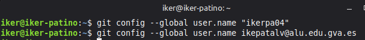

**De nou, només cal fer-ho una vegada si especifiques l’opció –global, ja que Git sempre utilitzarà aquesta informació per a tot el que facis en aquest sistema.**

**Clonar el repositori remot. Copia la url SSH del repositori (no copiïs la URL https) i clonarem el repositori al nostre ordinador.**

**git clone [**git@github.com**](mailto:git@github.com):xxxxxxx/xxxxxxx.git**

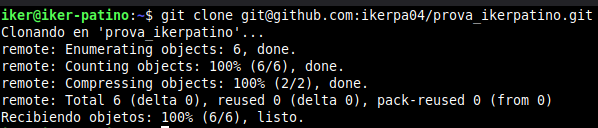

**Para comprobar que tienes configurado el repositorio usando la url SSH puedes ver el fichero de configuración en .git/config.**

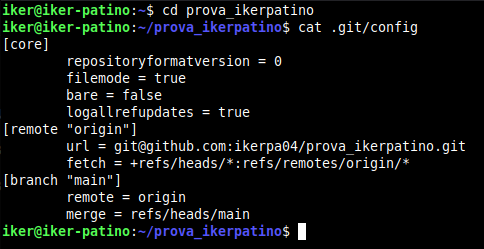

**Comprova que dins del repositori que hem creat hi ha el fitxer README.md, en aquest fitxer podem posar la descripció del projecte.**

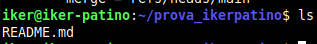

**Crearem un nou fitxer, l’afegirem al nostre repositori local i després ho sincronitzarem amb el nostre repositori remot de GitHub. Cada vegada que fem una modificació en un fitxer ho podem assenyalar creant un commit. Els missatges dels commits són fonamentals per explicar l’evolució d’un projecte.**

**Un commit ha de ser un petit conjunt de canvis dels fitxers del projecte amb una certa coherència.**

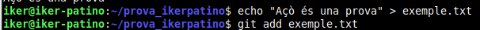

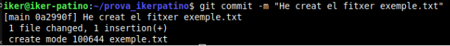

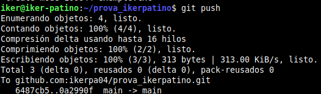

**Per comprovar l’estat del meu repositori local:**

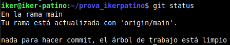

**Busca informació per a crear un nou repositori anomenat prova2\_el\_teu\_nom. En aquesta ocasió, crea primer el repositori local (usant git init) i després cerca informació per sincronitzar-lo i crear el repositori remot a GitHub.**

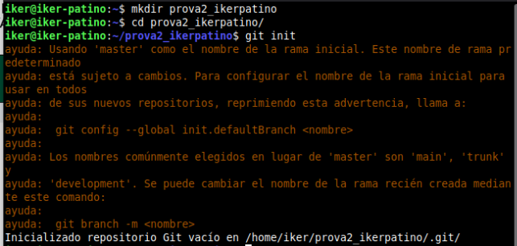

**Ahora añadimos texto al README.md.**

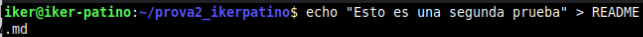

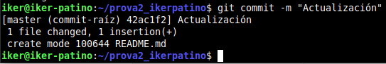

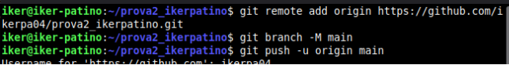
