Iker Patiño Alvarez Implantació d'Aplicacions Web

**Exercici 2: Introducció a Markdown**

1. **Crea una carpeta en un repositori local (creat en l’exercici anterior) que s’anomene IAW\_mark- down, que incloga un fitxer README.md.**

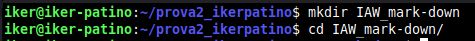

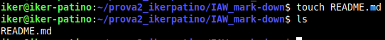

2. **Afegeix contingut al fitxer README.md utilitzant tots els elements de la sintaxi de Markdown que hem recordat. Entre altres inclou:**
- **una imatge al document que sigui un enllaç a una URL externa.**
- **crea un directori anomenat img al repositori i afegeix una imatge.**
- **incorpora la imatge que has afegit dins del document.**

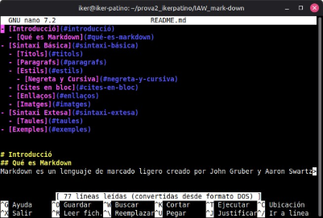

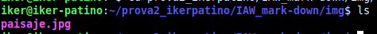

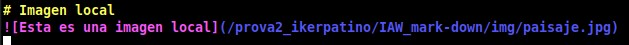

3. **Crea un nou document markdown al repositori.**

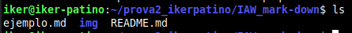

4. **Crea un enllaç des del fitxer README.md al nou document que acabes de crear**

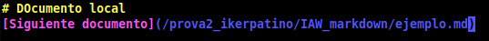

5. **Generar un document .pdf a partir del fitxer markdown.md**

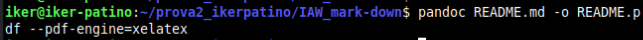

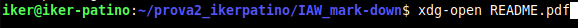

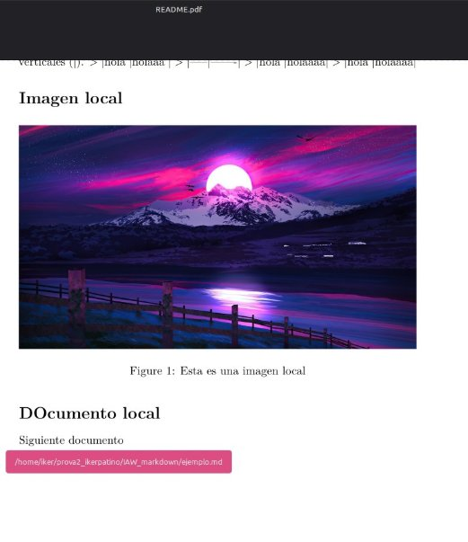

**Ahora después de subirlo a github, podemos comprobar que está todo.**

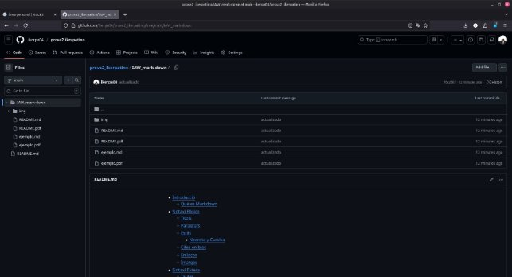
