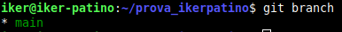
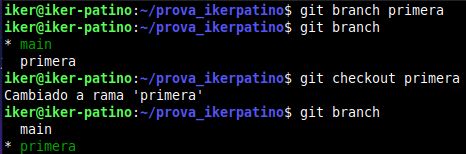
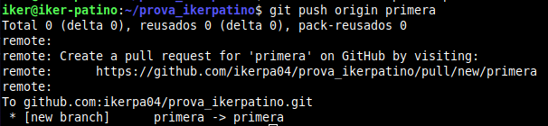
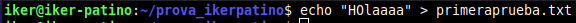
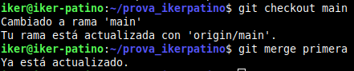
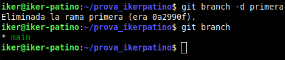
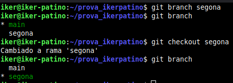
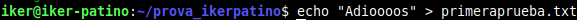
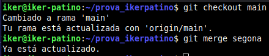

Iker Patiño Alvarez Implantació d'Aplicacions Web

**Pràctica 01 – Git. Treballant amb branques i unions**

1. **Crea una branca que s’anomene primera al teu repositori local, i executa la instrucció necessària per comprovar que s’ha creat.**

   Para ello desde la terminal, entramos a la carpeta de nuestro repositorio y comprobamos las ramas que hay.

Ahora creamos una rama nueva, comprobamos que la rama se ha creado, luego cambiamos a la rama para hacer cambios desde la nueva rama y comprobamos que estamos en la rama correcta.

Ahora subimos la rama a github.

2. **Crea un nou fitxer en aquesta branca i fusiona’l amb la principal. S’ha produït un conflicte? Raona la resposta.**

   Crearemos un nuevo documento añadiendo texto en el.

Ahora fusionaremos esta rama con la principal, para ello cambiamos a la rama principal y fusionamos.

3. **Esborra la branca primera.**

Ahora borramos la rama que creamos anteriormente y comprobamos.

4. **Crea una branca que s’anomene segona, i modifica un fitxer per produir un conflicte en unir-lo a la branca principal. Lliura el contingut del fitxer on s’ha produït el conflicte.**

   A continuación creamos una nueva rama como vimos anteriormente.

Ahora modificaremos el texto que creamos anteriormente.

Ahora fusionaremos a la rama principal.

5. **Soluciona el conflicte que has creat al punt anterior i sincronitza la branca segona al remot.**
