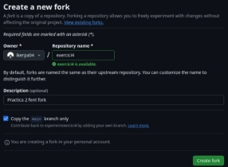

Iker Patiño Alvarez Implantació d'Aplicacions Web

**Pràctica 2: Col·laborant - pull**

**request (PR)**

**Què has de fer?**

Un pull request és una petició que es fa al propietari d’un repositori original perquè incorpore els

canvis que suggereixes. En aquest exercici has de fer un pull request sobre el repositori següent: (<https://github.com/espemm/exercici4.git>)

**Per això:**

- Realitza primer un pull request al repositori per sol·licitar dos canvis:
- Has de canviar el fitxer **README.md** per afegir un enllaç a la llista, on pose les teues inicials i vaja al fitxer que crearàs en el directori **files**.
- Crea un fitxer al directori **files**, que s’anomene les\_teus\_inicials.md (en el meu cas s’anomena-ria emm.md) i on escrigues a markdown la resposta a la pregunta: Quin mòdul t’agrada més? I per què (cal utilitzar almenys 5 marques diferents de markdown). Realitza el pull request (amb un missatge de commit significatiu) i espera que sigua acceptat per mi. En acabar l’exercici has de sincronitzar el teu repositori perquè tingues tots els fitxers de tots els teus companys.
- Tria un company i fes un Pull Request sobre un repositori seu. El mateix company o un altre ha de fer un Pull Request sobre un repositori teu.

Primero iremos al enlace y crearemos un nuevo fork.

Ahora clonamos el repositorio en local.

Comprobamos el repositorio.

Creamos una rama y la subimos a github.

Ahora copiamos la imagen que hemos descargado a la carpeta files dentro del repositorio.

Ahora editamos el archivo README.md para que al clickar en nuestro nombre nos envíe a la imagen.

A continuación en files creamos un archivo con nuestras iniciales donde usamos md.

Ahora cambiamos de rama a **main** para luego fusionar las ramas.

Borramos la rama y a continuación lo subimos a github.

Ahora comprobamos que se ha actualizado en nuestro repositorio pero NO en el de la profe.

Ahora haremos un pull request.

Ahora esperamos que la profesora acepte nuestro pull request.

Ahora, en un repositorio de un compañero (Fran), realizaremos los mismos pasos anteriores para comprobar que funciona.

Una vez hayamos clonado el repositorio de manera local, crearemos un archivo para actualizar.

Como observamos en la siguiente captura, hemos visto que se ha actualizado con mi fichero pero todavía no se ha hecho un pull request.

Ahora esperamos a que mi compañero fran acepte el pull request,

De mientras, aceptaremos el pull request de nuestro compañero en nuestro repositorio.

Ahora vemos dentro de nuestro repositorio el cambio que ha hecho fran, que es “probafran.txt”.

Ahora iremos a su repositorio a ver si nos lo ha aceptado y veremos el cambio dentro de su repositorio.

Que como comprobamos se ha hecho un merge en el pull request y vemos mi archivo “iker.txt”
