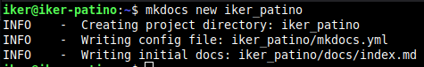
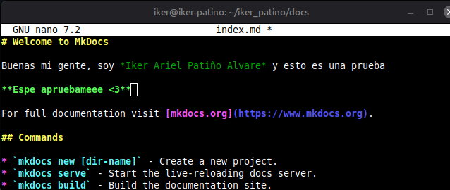
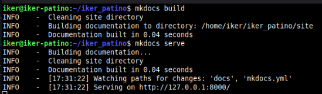
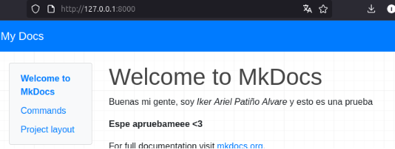
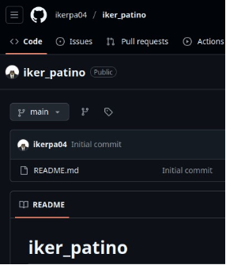
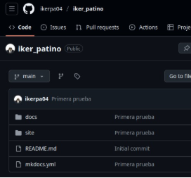
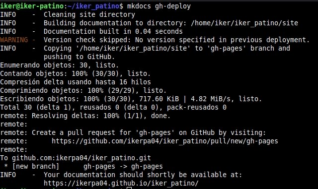
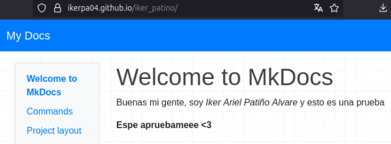

Iker Patiño Alvarez Implantació d'Aplicacions Web

**Pràctica 3: Mkdocs - Github Pages**
# **Què has de fer?**
**En aquesta pràctica desplegarem una pàgina web estàtica amb MkDocs i GitHub Pages. Per això, segueix els passos següents:**

- **Crea un nou projecte de MkDocs al teu ordinador.**
- **Escriu la documentació del vostre projecte en format Markdown.**
- **Genera la pàgina web amb MkDocs.**
- **Crea un repositori al GitHub per al teu projecte.**
- **Puja la pàgina web a GitHub Pages.**
- **Comprova que la URL de la teua pàgina web a GitHub Pages funciona correctament.**

Primero instalamos *mkdocs* en nuestro equipo. A continuación creamos un nuevo proyecto.

Ahora entramos a una carpeta llamada docs, dentro tendremos el fichero que se muestra en la pagina, modificamos un poco.

Ahora creamos la página web y la lanzamos como web local.

Que como comprobamos, si ponemos la dirección IP que nos indica, veremos la página.

Ahora creamos un repositorio en github.

Ahora desde dentro del proyecto mkdocs, haremos los comandos que vimos en practicas anteriores para subir lo que tenemos en el proyecto a github.

Y comprobamos que tenemos todo.

Ahora subimos la página a GithubPages.

Entramos al enlace que nos indica y comprobamos.

**Enlaces:**

Repositorio github: [https://github.com/ikerpa04/iker_patino.git ](https://github.com/ikerpa04/iker_patino.git)
Página GitHub Pages: <https://ikerpa04.github.io/iker_patino/>
