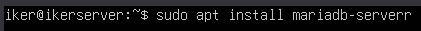
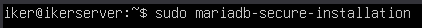
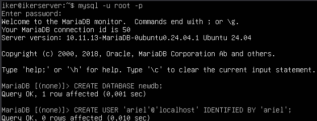
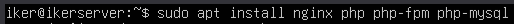
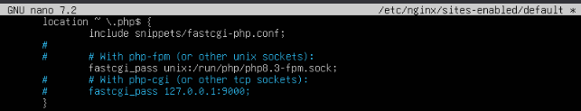
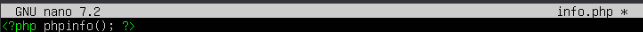
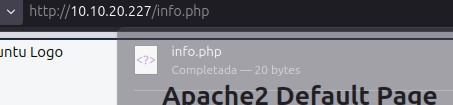
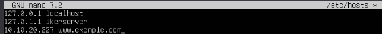
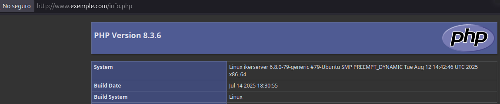

**Practica 1: Instalación de un**

**servidor LEMP**
# **Instalación del servidor de base de datos**
Instalamos la base de datos.

Ejecutamos la configuración segura inicial.

Creamos una base de datos y un usuario nuevo.

# **Instalación de Nginx i PHP**
Instalamos los paquetes necesarios.

# **Verificación del funcionamiento de nginx**
Tenemos que modificar el archivo de configuración.

Accedemos desde el navegador, a la pagina web de inicio del servidor

# **Verificación del funcionamiento de PHP**
Creamos un fichero dentro del directorio /var/www/html.

Comprobamos que los ficheros servidos por Apache son propiedad de www-data:www-data. Accedemos al navegador y vemos la configuración php instalado.

# **Acceso con nombre (resolución de nombres)**
Editamos el archivo /etc/hosts y añadimos la dirección IP y el nombre.

Ahora visitamos otra vez la página web.

