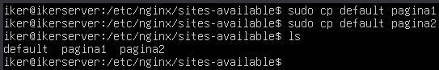
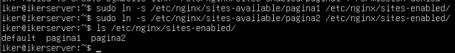
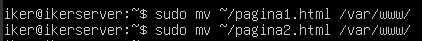
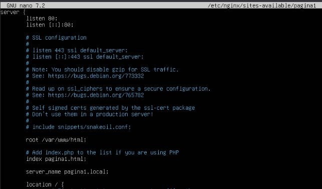
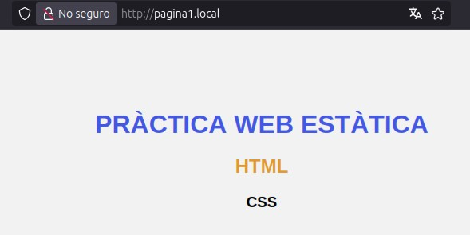
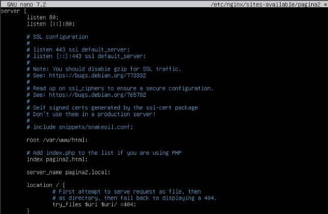
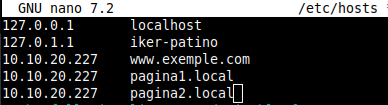
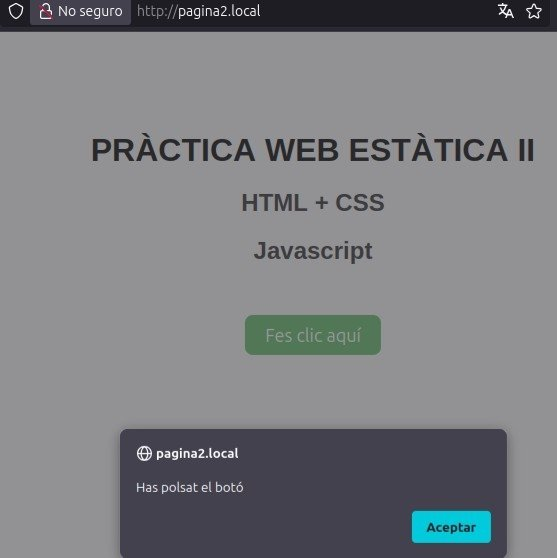

**Pràctica 2: Servir múltiples dominis**
# **Virtual hosting amb nginx**
Copiamos dos veces el fichero de por defecto.

Antes de configurar los ficheros, crearemos los enlaces directos.

Ahora descargaremos las dos páginas que indicaremos que enfoquen allí.

Movemos los ficheros en la carpeta /var/www/.

A continuación modificaremos el fichero de configuración de la página1.

Ahora añadiremos en el fichero /etc/hosts del equipo principal.

Y ahora comprobamos en el navegador.

Ahora modificamos el fichero de la página2.

Ahora modificamos el fichero /etc/hosts.

Y comprobamos en el navegador.

