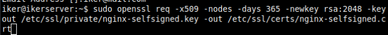
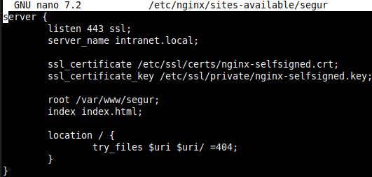
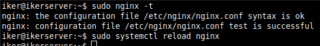
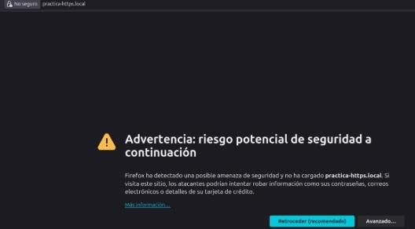
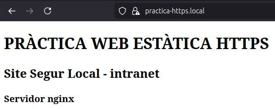

**Pràctica 3: Certificat SSL/TLS**
# **Creación Certificado**
Crearemos el certificado autofirmado.

Luego nos dirá que pongamos unos datos.

# **Automatizar creación del certificado autofirmado**
Automatizamos creando un script.

# **Consultar certificado**
Consultar información del sujeto del certificado.

Consultar la fecha de caducidad del certificado.

# **Configurar un Block SSL/TSL en Nginx**
**Configurar el Bloc SSL** Configuramos el sitio seguro ssl.

**Creamos el sitio seguro** Creamos el siguiente directorio.

Creamos el documento de inicio.

Aplicamos cambios y reiniciamos el servicio.

**Verificamos el correcto funcionamiento** Desde un cliente accedemos por IP.

Vemos que nos salta una alerta de advertencia, en *Avanzado* aceptamos el riesgo.

Ahora volvemos a entrar con el nombre de la página.

Volvemos a realizar el proceso para acceder.

**Block de redirección de HTTP a HTTPS.**

En el bloque de por defecto *default* y añadimos las siguientes líneas.

Reiniciamos el servicio y entramos en el navegador pero con el enlace con http.

Y al buscar, vemos que nos redirigió a https.

